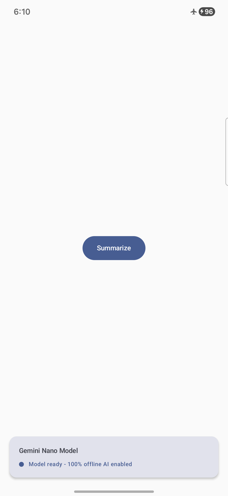
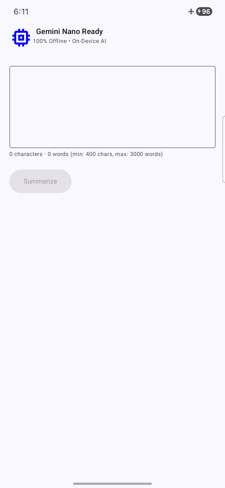

# Miyabi Nano

An Android engineering study of OS-supported on-device AI through Android AICore
and ML Kit GenAI APIs.

`miyabi-nano` explores what application engineers still own when the platform
vendor supplies the model execution path: capability detection, provisioning UX,
lifecycle behavior, failure handling, measurement, privacy boundaries, and
realistic product limits.

This repository is not intended to mirror `iki-nano`. The portfolio lanes answer
different engineering questions:

- `iki-nano` explores iOS self-managed runtime engineering.
- `miyabi-nano` explores Android OS-supported on-device AI experimentation.

The goal is evidence-backed educational material, not feature parity and not a
wrapper-demo feature checklist.

## Screenshots

<p align="center">
  
  
</p>

## Features

- **On-Device Text Summarization:** Summarize long texts entirely on-device using Gemini Nano
- **Automatic Model Download:** The app automatically downloads the Gemini Nano model when needed
- **Download Progress Tracking:** Real-time progress updates during model download
- **Offline Capability:** Once the model is downloaded, summarization works 100% offline
- **Modern Android Architecture:** Clean Architecture with MVVM pattern
- **Material 3 Design:** Modern UI built with Jetpack Compose and Material 3

## Tech Stack

- **Language:** Kotlin
- **UI Framework:** Jetpack Compose
- **Design System:** Material 3
- **Minimum SDK:** 34 (Android 14)
- **Target SDK:** 36 (Android 15)
- **Architecture:** Clean Architecture + MVVM
- **Dependency Injection:** Hilt
- **Navigation:** Navigation Compose
- **Asynchronous:** Kotlin Coroutines & Flow
- **Build System:** Gradle with Kotlin DSL
- **Annotation Processing:** KSP (Kotlin Symbol Processing)
- **ML Framework:** Google GenAI Summarization (Gemini Nano)

## Prerequisites

- **Android Studio:** Hedgehog (2023.1.1) or later
- **JDK:** 17 or later
- **Gradle:** 8.0+ (included in wrapper)
- **Compatible Device:** Android device running Android 14 (API 34) or later with Gemini Nano support

## Device Compatibility & Limitations

### Important: Gemini Nano Availability

Gemini Nano availability is not implied by Android version alone. ML Kit
maintains an official [GenAI API device-support matrix](https://developers.google.com/ml-kit/genai#device_support).
The definitive answer for a configured feature on a specific device is the
runtime `checkFeatureStatus()` result.

ML Kit GenAI APIs rely on Android AICore. Availability can vary by device,
Gemini Nano base-model version, downloaded feature assets, language
configuration, and AICore initialization state. The official API documentation
also states that these APIs are not supported on devices with an unlocked
bootloader.

### Repository Device Observations

This table records repository observations, not a general support guarantee.

| Date | Device identity | Android version | Repository observation |
| --- | --- | --- | --- |
| 2026-06-02 | `samsung SM-F731B` | Android 16 / API 36 | Device attached for future real-device validation. Capability-specific AICore status has not yet been recorded. |

### Unsupported And Not-Yet-Ready Devices

The repository is working toward capability-specific unsupported-device UX.
The current implementation checks summarizer status on the main screen, but it
does not yet prove complete readiness handling for every visible capability.
See the implementation plan for the lifecycle work required before broader
claims are made.

## Setup Instructions

### 1. Clone the Repository

```bash
git clone <repository-url>
cd miyabi-nano
```

### 2. Open in Android Studio

1. Launch Android Studio
2. Select **File → Open**
3. Navigate to the cloned `miyabi-nano` directory
4. Click **OK**
5. Wait for Gradle sync to complete

### 3. Configure Local Properties

The project includes a `local.properties` file (not tracked in git) that contains your Android SDK path. Android Studio typically creates this automatically.

If needed, create it manually:

```properties
sdk.dir=/path/to/your/Android/sdk
```

### 4. Build the Project

```bash
./gradlew build
```

Or use Android Studio's build menu: **Build → Make Project**

### 5. Run the Application

1. Connect an Android device (API 34+) or start an emulator
2. Click the **Run** button in Android Studio (or press `Shift + F10`)
3. The app will:
   - Check if Gemini Nano is available on your device
   - Prompt to download the model if supported
   - Display compatibility information if not supported

## Project Structure

```
miyabi-nano/
├── app/
│   ├── src/
│   │   ├── main/
│   │   │   ├── java/dev/picon/android/miyabinano/
│   │   │   │   ├── di/                    # Dependency injection modules
│   │   │   │   ├── domain/                # Business logic & use cases
│   │   │   │   ├── navigation/            # Navigation setup
│   │   │   │   ├── ui/                    # UI layer
│   │   │   │   │   ├── main/              # Main menu & model download
│   │   │   │   │   ├── summarize/         # Summarization feature
│   │   │   │   │   └── theme/             # App theme & styling
│   │   │   │   ├── MainActivity.kt        # App entry point
│   │   │   │   └── MiyabiNanoApplication.kt
│   │   │   └── AndroidManifest.xml
│   │   ├── test/                          # Unit tests
│   │   └── androidTest/                   # Instrumentation tests
│   └── build.gradle.kts                   # App module build config
├── gradle/                                # Gradle wrapper files
├── build.gradle.kts                       # Root build config
├── settings.gradle.kts                    # Project settings
└── README.md
```

## How It Works

### Architecture Overview

The app follows Clean Architecture principles:

1. **UI Layer (Compose):** Declarative UI with state hoisting
2. **ViewModel Layer:** Manages UI state and business logic
3. **Domain Layer:** Contains use cases (business rules)
4. **Data Layer:** Wraps the Gemini Nano summarization API

### Text Summarization Flow

1. User enters text (min 100 characters, max 1000 words)
2. User taps "Summarize" button
3. App checks if model is downloaded
4. If not downloaded, app prompts for download with progress tracking
5. Once ready, text is sent to Gemini Nano for processing
6. Summary appears on screen (100% on-device, no internet needed)

### Model Download

The app uses Google's GenAI Summarization API which:
- Surfaces feature-download callbacks when configured assets are downloadable
- Relies on Android AICore for system-managed Gemini Nano access
- Provides download progress callbacks
- Exposes download failures for application-level recovery UX

## Usage

### Basic Text Summarization

1. Open the app
2. If prompted, allow model download (one-time setup)
3. Enter or paste text to summarize
   - Minimum: 100 characters
   - Maximum: 1000 words
4. Tap "Summarize"
5. Wait for on-device processing
6. View the generated summary

### Tips

- **First Launch:** Model download can take several minutes depending on network speed
- **Offline Use:** After initial download, no internet connection is needed
- **Text Length:** Longer texts may take a few seconds to process
- **Privacy:** All processing happens on-device; no data leaves your phone

## Building for Release

```bash
./gradlew assembleRelease
```

The APK will be generated in:
```
app/build/outputs/apk/release/app-release-unsigned.apk
```

For signed releases, configure signing in `app/build.gradle.kts`.

## Troubleshooting

### Gradle Sync Issues

```bash
./gradlew clean build --refresh-dependencies
```

### Model Download Fails

- Ensure stable internet connection
- Check available storage space (need ~2 GB free)
- Verify device compatibility
- Check Google Play Services is updated

### App Won't Run

- Verify minimum SDK is 34 (Android 14)
- Check that device/emulator is running Android 14+
- Ensure Gradle sync completed successfully

### "Model Not Available" Message

This is normal on unsupported devices. See [Device Compatibility](#device-compatibility--limitations) section above.

## Privacy & Security

- **100% On-Device Processing:** Text never leaves your device
- **No Analytics:** No user data collection or tracking
- **No Network After Download:** Internet only needed for initial model download
- **Local Storage:** Model stored in app's private storage

## Contributing

We welcome contributions! Here's how you can help:

1. **Report Issues:** Found a bug or have a feature request? [Open an issue](../../issues/new)
2. **Submit Pull Requests:**
   - Fork the repository
   - Create a feature branch (`git checkout -b feature/amazing-feature`)
   - Commit your changes (`git commit -m 'Add amazing feature'`)
   - Push to the branch (`git push origin feature/amazing-feature`)
   - Open a Pull Request

Please ensure your code follows:
- Kotlin coding conventions
- Material 3 design guidelines
- Clean Architecture principles
- Existing project structure

## License

MIT License

Copyright (c) 2024 Armando Picon

Permission is hereby granted, free of charge, to any person obtaining a copy
of this software and associated documentation files (the "Software"), to deal
in the Software without restriction, including without limitation the rights
to use, copy, modify, merge, publish, distribute, sublicense, and/or sell
copies of the Software, and to permit persons to whom the Software is
furnished to do so, subject to the following conditions:

**The above copyright notice and this permission notice shall be included in all
copies or substantial portions of the Software.**

THE SOFTWARE IS PROVIDED "AS IS", WITHOUT WARRANTY OF ANY KIND, EXPRESS OR
IMPLIED, INCLUDING BUT NOT LIMITED TO THE WARRANTIES OF MERCHANTABILITY,
FITNESS FOR A PARTICULAR PURPOSE AND NONINFRINGEMENT. IN NO EVENT SHALL THE
AUTHORS OR COPYRIGHT HOLDERS BE LIABLE FOR ANY CLAIM, DAMAGES OR OTHER
LIABILITY, WHETHER IN AN ACTION OF CONTRACT, TORT OR OTHERWISE, ARISING FROM,
OUT OF OR IN CONNECTION WITH THE SOFTWARE OR THE USE OR OTHER DEALINGS IN THE
SOFTWARE.

## Acknowledgments

- Built with [Jetpack Compose](https://developer.android.com/jetpack/compose)
- Uses [Google GenAI Summarization API](https://developer.android.com/ai/genai)
- Powered by [Gemini Nano](https://deepmind.google/technologies/gemini/nano/)

## Additional Resources

- [Google AI on Android Documentation](https://developer.android.com/ai)
- [Jetpack Compose Documentation](https://developer.android.com/jetpack/compose/documentation)
- [Gemini Nano Overview](https://ai.google.dev/gemini-api/docs/models/gemini#gemini-nano)
- [Android Architecture Guide](https://developer.android.com/topic/architecture)
