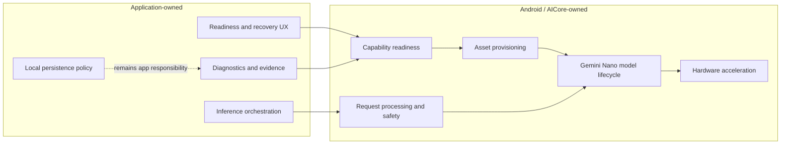
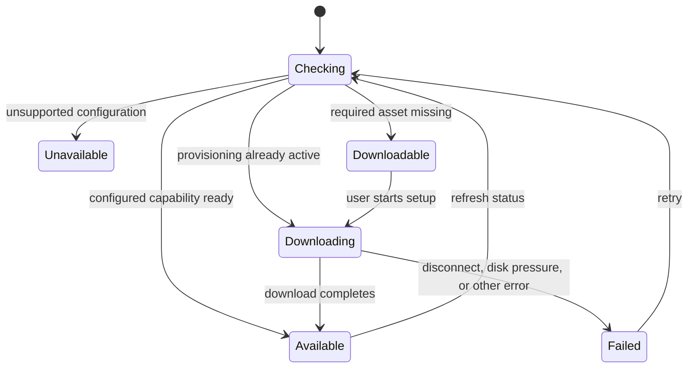
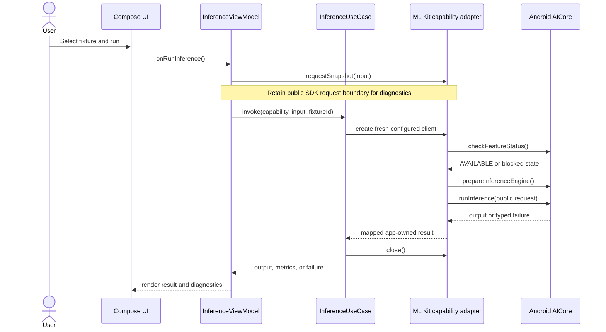
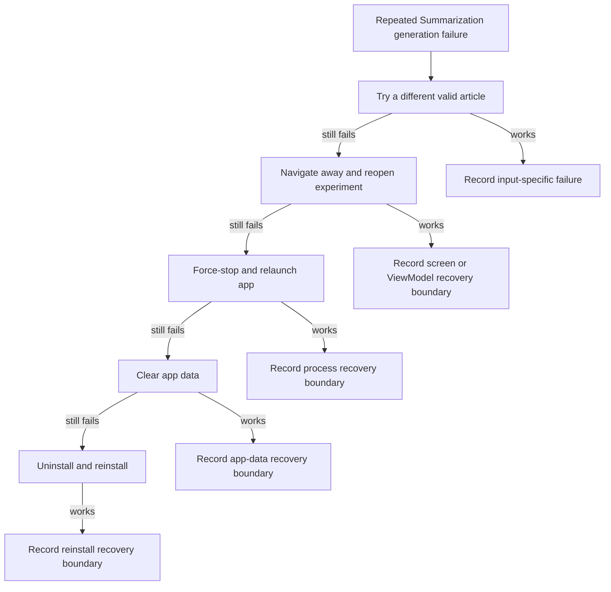

# Miyabi Nano System Flow Diagrams

## Responsibility Boundary

## Capability Provisioning

## Inference Attempt

## Summarization Recovery Investigation

The repository observed Summarization recovering after uninstall and reinstall.
The smallest required recovery boundary remains unknown.

Do not add a speculative reset-model button. ML Kit exposes configured client
close and recreation, but not a public model-reset API.
