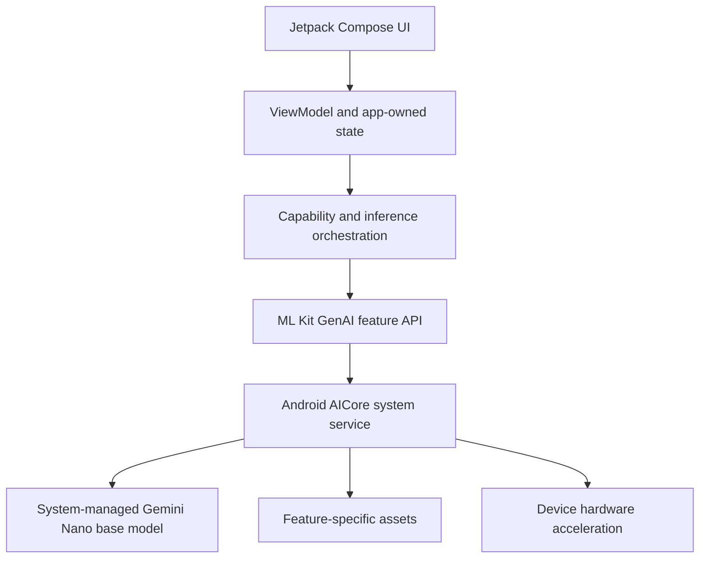

# AICore And Gemini Nano: Basic Concepts

## The Short Version

Gemini Nano is an on-device foundation model. Android exposes supported Gemini
Nano capabilities through AICore, an Android system service. This repository
uses ML Kit GenAI APIs as the application-facing SDK boundary.

The app does not ship a model file, choose a low-level accelerator, or build a
native inference runtime. It asks the platform whether a configured capability
is ready and invokes a feature-specific API when available.

## The Stack

## Important Terms

### Base Model

The system-managed Gemini Nano model exposed through AICore. Different devices
can expose different versions. The app retrieves the observed identity using
`getBaseModelName()`.

### Capability

A configured feature API such as Summarization, Proofreading, or Rewriting.
Capabilities can have different readiness states even when they share a base
model.

### Feature-Specific Asset

Additional platform-managed data required by a configured capability. A base
model already existing on the phone does not prove every capability is ready.

### Provisioning

The lifecycle that makes required assets available. A capability can be:

- unavailable
- downloadable
- downloading
- available
- failed with a recoverable or terminal reason

### Public SDK Request Versus Internal Prompt

Feature-specific APIs do not necessarily expose a developer-authored prompt.
For Summarization, this app submits article text through
`SummarizationRequest.builder(text).build()` and configures public options such
as `ARTICLE`, `ONE_BULLET`, and `ENGLISH`.

The platform-managed internal prompt is not exposed by ML Kit. The diagnostics
modal shows the exact public request boundary without inventing hidden details.

## What `AVAILABLE` Means

`checkFeatureStatus()` is the runtime readiness signal for a configured
capability. `AVAILABLE` means the capability is ready to attempt inference. It
does not guarantee successful output for every input or every transient AICore
state.

## Official References

- [Gemini Nano on Android](https://developer.android.com/ai/gemini-nano)
- [ML Kit GenAI APIs](https://developers.google.com/ml-kit/genai)
- [Summarization API](https://developers.google.com/ml-kit/genai/summarization/android)
